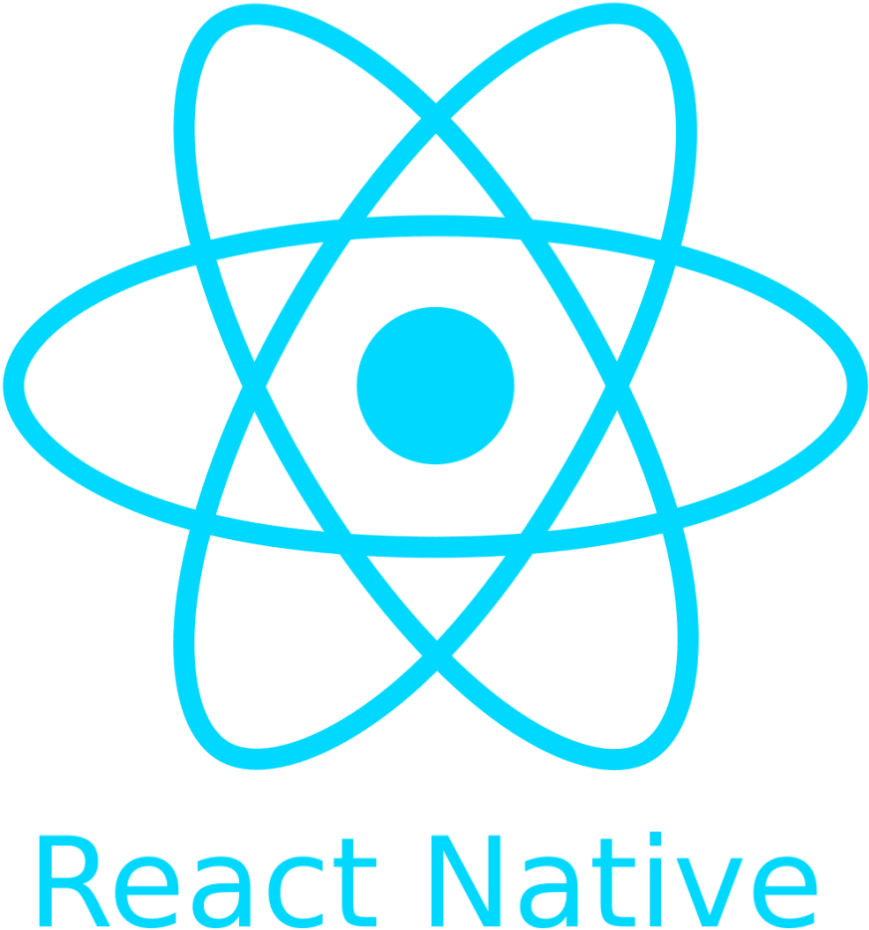

  

  
  

  

  
  

   
  
  

<!-- ##  -->

<!-- about me -->
<!--
**Crzek/Crzek** is a ✨ _special_ ✨ repository because its `README.md` (this file) appears on your GitHub profile.

-->

<h3>About me:</h3>

<ul>
<li>🔭 Currently working on various Python projects and my WebSite</li>
<li>🌱 I’m currently learning TypeScript, React, React Native and Flutter</li>
<li>🤔 I’m looking for help with Kubernetes</li>
<li>💬 Ask me about Python, Django, Flask, FastAPI, JavaScript, React</li>
<li>📫 How to reach me: <a href="mailto:crzerick6@gmail.com" target="_blank">Contact with Erick</a></li>
</ul>

---

<!-- Lenguges de programacion -->

  

    <h3>🛠️ Programming and Markup Languages</h3>
    
&nbsp;
      &nbsp;
      &nbsp;
      &nbsp;
      &nbsp;
      &nbsp;
      <!-- &nbsp; -->
    

  

  

    <h3>📚 Frameworks and Libraries</h3>
    

      &nbsp;
      &nbsp;
      &nbsp;
      &nbsp;
      &nbsp;
      &nbsp;
      &nbsp;
      &nbsp;
      &nbsp;
      &nbsp;
      &nbsp;
      &nbsp;
      &nbsp;
    

  

  

    <h3>🗄️ Databases and Cloud Hosting</h3>
    

      &nbsp;
      &nbsp;
      &nbsp;
      &nbsp;
      &nbsp;
      &nbsp;
      <!-- &nbsp; -->
    

  

---

<!-- stats  -->

<h3>📊 My GitHub Stats :</h3>

  

    
💻 GitHub Profile Stats

    
  

  

    
🔥 Streak Stats

    
  

  

    
🔥Top Lenguage

    

